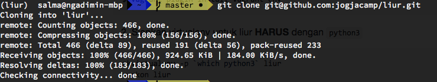
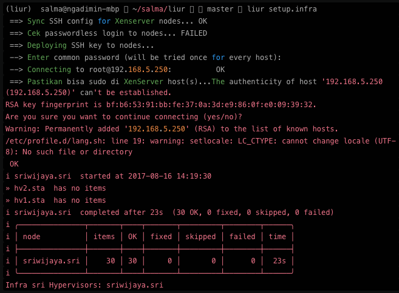

### Config LIUR

```shell
$ git clone git@github.com:jogjacamp/liur.git
```


```shell
$ cd liur

$ pip install -r requirements.txt

$ python setup.py develop
```

* Jika gagal, ketikkan :

```shell
$ pip install cryptography --global-option=build_ext --global-option="-L/usr/local/opt/openssl/lib" --global-option="-I/usr/local/opt/openssl/include"
```

* Install vagrant plugin `vagrant-xenserver`

```shell
$ vagrant plugin install scripts/vagrant-xenserver-0.0.14.gem

$ liur setup.me

$ liur setup.infra
```


* Buat file private key .secrets.cfg di dalam /liur (private key : dari orang yg pertama kali buat project)

```shell
$ vim ~/salma/liur/.secrets.cfg
```
