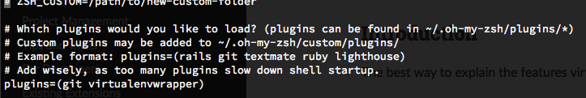

### Install Virtualenvwrapper

* Buka `Terminal`

* Install `Virtualenwrapper`

```shell
$ pip install virtualenvwrapper
```

* Edit file `~/.zshrc` --> `plugin=(git virtualenvwrapper) `

```shell
$ vim ~/.zshrc
```


* Buat virtualenv baru

```shell
$ mkvirtualenv -p `which python3` liur

$ workon liur
```